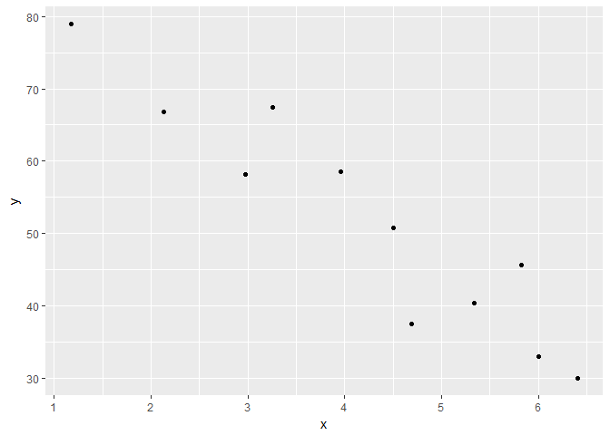
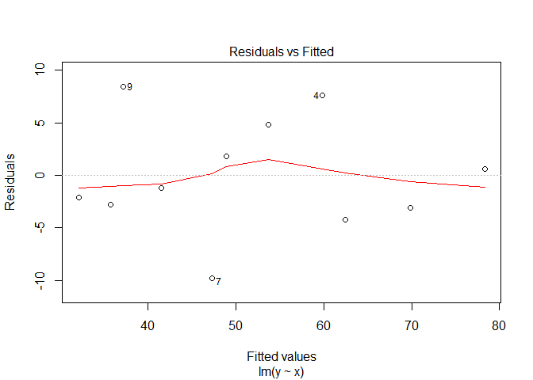
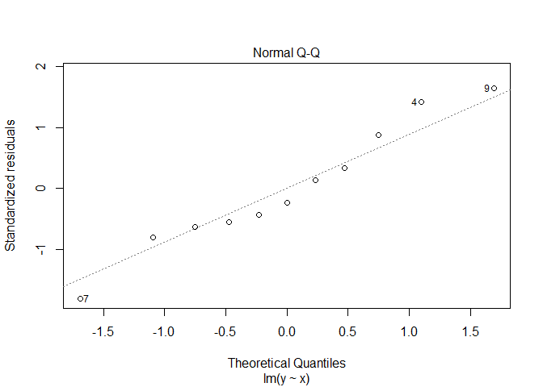
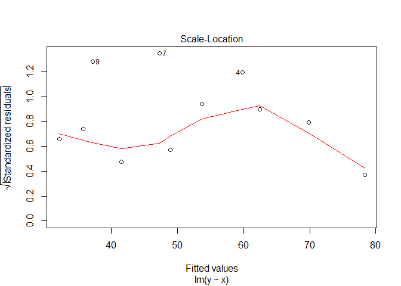
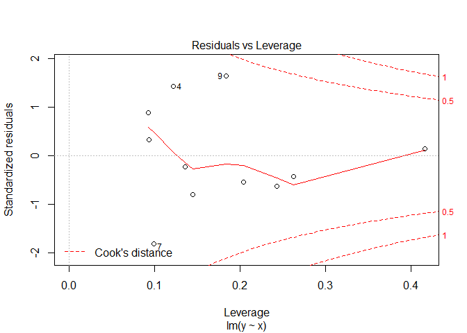

``` r
library(ggplot2)
```

``` r
data <- read.table("https://raw.githubusercontent.com/basilhan/datasets/master/slr.csv",
                   sep=",",
                   header=FALSE,
                   )
names(data) <- c("x", "y")
```

``` r
head(data)
```

    ##      x     y
    ## 1 1.17 78.93
    ## 2 2.13 66.76
    ## 3 2.97 58.20
    ## 4 3.26 67.47
    ## 5 3.96 58.49
    ## 6 4.50 50.72

``` r
options(repr.plot.width=5, repr.plot.height=3)
ggplot(data, aes(x=x, y=y)) + geom_point()
```



``` r
model <- lm(y ~ x, data=data)
model
```

    ## 
    ## Call:
    ## lm(formula = y ~ x, data = data)
    ## 
    ## Coefficients:
    ## (Intercept)            x  
    ##      88.655       -8.826

``` r
summary(model)
```

    ## 
    ## Call:
    ## lm(formula = y ~ x, data = data)
    ## 
    ## Residuals:
    ##    Min     1Q Median     3Q    Max 
    ## -9.790 -2.936 -1.203  3.285  8.452 
    ## 
    ## Coefficients:
    ##             Estimate Std. Error t value Pr(>|t|)    
    ## (Intercept)   88.655      4.821  18.389 1.90e-08 ***
    ## x             -8.826      1.071  -8.241 1.75e-05 ***
    ## ---
    ## Signif. codes:  0 '***' 0.001 '**' 0.01 '*' 0.05 '.' 0.1 ' ' 1
    ## 
    ## Residual standard error: 5.701 on 9 degrees of freedom
    ## Multiple R-squared:  0.883,  Adjusted R-squared:   0.87 
    ## F-statistic: 67.91 on 1 and 9 DF,  p-value: 1.745e-05

``` r
options(repr.plot.width=5, repr.plot.height=3)
plot(model)
```


